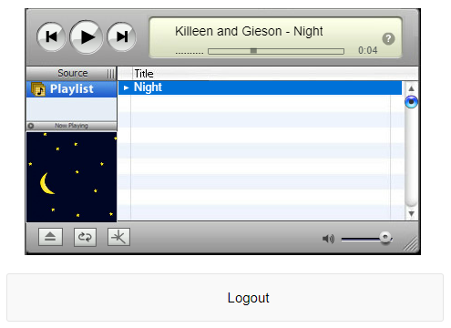

# streamp3
An SQL+HTML/PHP/CSS based mp3 player [](https://github.com/tackyunicorn/streamp3/issues)
<p align="center">
  
</p> 

## Database Setup
This project uses MySQL as a backend for storing information of users and the music files  
* Create a database - **music**  
	```mysql
	CREATE DATABASE music;
	```  

* Under the music database, create two tables - **mp3s** and **users**  
	```mysql
	CREATE TABLE `mp3s` (
	`id` int(5) NOT NULL,
	`filename` varchar(100) NOT NULL,
	`artist` varchar(100) NOT NULL,
	`title` varchar(100) NOT NULL,
	`visual` varchar(100) NOT NULL,
	`comments` varchar(100) NOT NULL,
	PRIMARY KEY (`id`),
	UNIQUE KEY `title` (`title`)
	) ENGINE=InnoDB DEFAULT CHARSET=utf8
	```  
	```mysql
	CREATE TABLE `users` (
	`uid` int(5) NOT NULL,
	`username` varchar(100) NOT NULL,
	`password` varchar(100) NOT NULL,
	PRIMARY KEY (`uid`)
	) ENGINE=InnoDB DEFAULT CHARSET=utf8
	```
## Server Setup
Host all the files onto your server  
* Edit the **wimpy.sql.ed.php** file to include the username and password of your MySQL installation
	```php
	$publicUser  = "yourusername";
	$publicPwd   = "yourpassword";
	```  
* Edit the **form.php** and **pass.php** to include the username and password of your MySQL installation
	```php
	$con=mysqli_connect("localhost" , "yourusername" , "yourpassword" , "music");
	```  
## Dumping data for tables
* Set up the **mp3s** table
	```mysql
	INSERT INTO `mp3s` (`id`, `filename`, `artist`, `title`, `visual`, `comments`) VALUES
	(1, 'Night.mp3', 'Killeen and Gieson', 'Night', 'http://localhost/mp3s/cover/Night.jpg', 'Y');
	```
* Set up the **users** table
	```mysql
	INSERT INTO `users` (`uid`, `username`, `password`) VALUES
	(1, 'admin', 'e10adc3949ba59abbe56e057f20f883e'),
	(2, 'user', 'c33367701511b4f6020ec61ded352059');
	```
> The admin and user passwords are stored as MD5 hashes  
	admin - 123456  
	user - 654321
